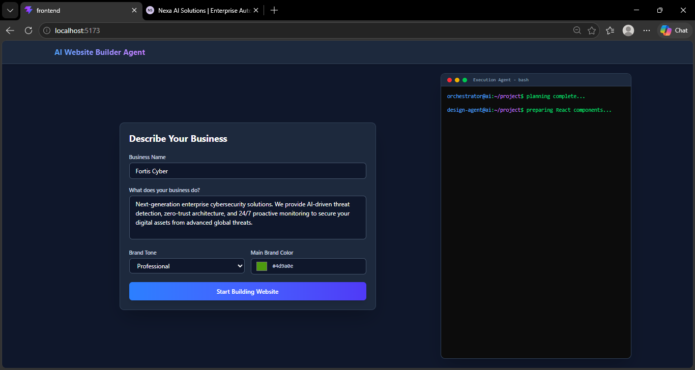
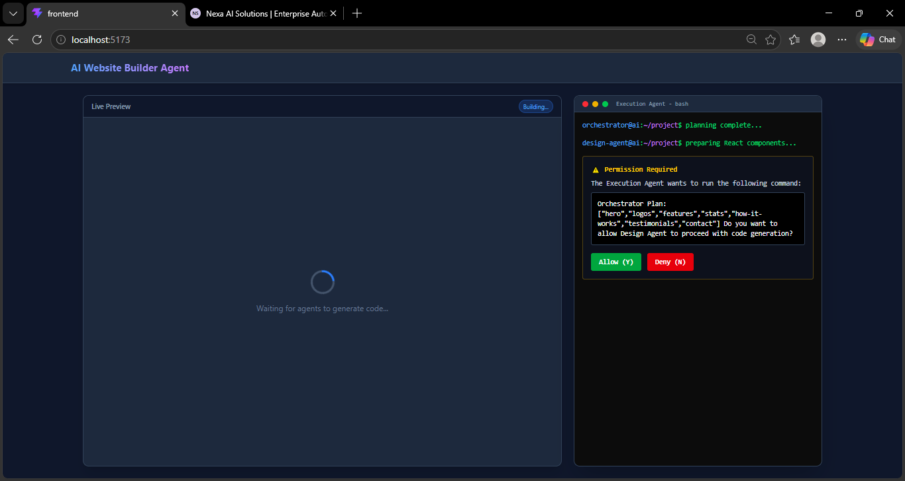

# AI Website Builder Agent

A powerful, AI-driven website builder that autonomously orchestrates, designs, and executes code to generate complete, multi-page, full-stack React and Tailwind CSS web applications based on simple user prompts.

## Project Gallery

<p align="center">
  
  
  
  
  
  
</p>

---

## Core Architecture

This platform utilizes a Multi-Agent Architecture powered by the Google Gemini API to automate the entire software development lifecycle. The system is comprised of four specialized agents:

### 1. Orchestrator Agent (Planning)
- **Function:** Processes the business requirements, intended tone, and brand color palette.
- **Action:** Generates a comprehensive structural plan for a multi-page web application.
- **Model:** gemini-3.5-flash

### 2. Asset Agent (Media Management)
- **Function:** Analyzes semantic context to extract core visual themes.
- **Action:** Dynamically generates precise logo components and fetches high-definition, photorealistic stock photography matching the brand's aesthetic requirements.
- **Model:** gemini-3.5-flash

### 3. Design Agent (Frontend Engineering)
- **Function:** Synthesizes the structural plan and media assets into production-ready code.
- **Action:** Generates a complete React component integrated with Tailwind CSS, featuring state-based multi-page routing, dynamic favicons, and seamless UI/UX design.
- **Model:** gemini-3.5-flash

### 4. Execution Agent (System Operations)
- **Function:** Handles file system orchestration and project scaffolding.
- **Action:** Automatically structures a complete local workspace comprising both a Vite React frontend and an Express Node.js backend.

---

## Technical Stack

- **Frontend Environment:** React, Tailwind CSS, Vite
- **Backend Infrastructure:** Node.js, Express, TypeScript
- **Artificial Intelligence:** Google Gemini 3.5 Flash
- **Data Persistence:** File-based JSON storage

## Deployment Instructions

1. Clone the repository to your local machine.
2. Configure your environment variables by adding `GEMINI_API_KEY` to `backend/.env`.
3. Initialize the AI Builder backend:
   ```bash
   cd backend
   npm install
   npm run dev
   ```
4. Initialize the Builder interface (Frontend):
   ```bash
   cd frontend
   npm install
   npm run dev
   ```
5. Access the interface via your local development server to generate a project.

## Running the Generated Application

Once the AI Builder successfully processes your request, the full-stack application is saved locally.
To run the generated application:

1. Start the generated Frontend:
   ```bash
   cd generated_workspace/frontend
   npm install
   npm run dev
   ```
2. Start the generated Backend:
   ```bash
   cd generated_workspace/backend
   npm install
   npm start
   ```

---
*Developed utilizing Google Gemini AI architecture.*
