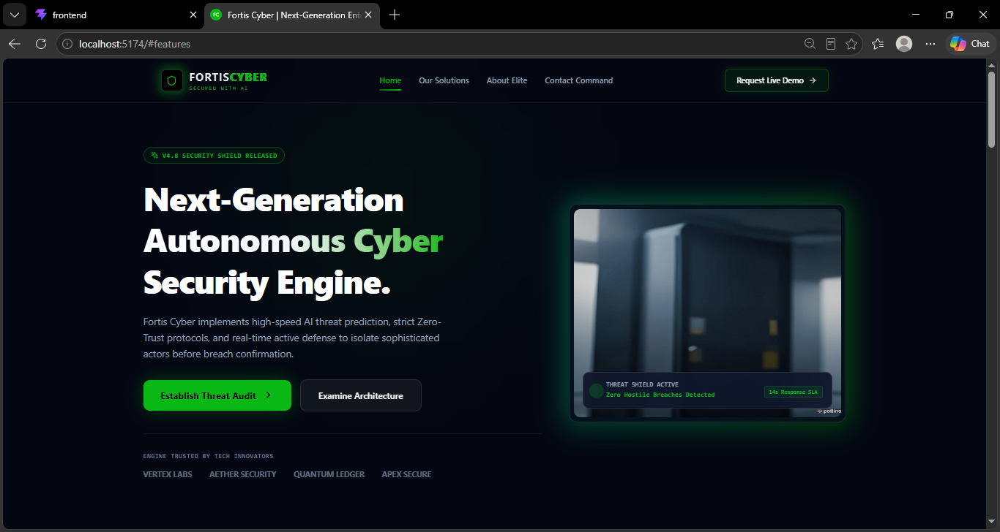
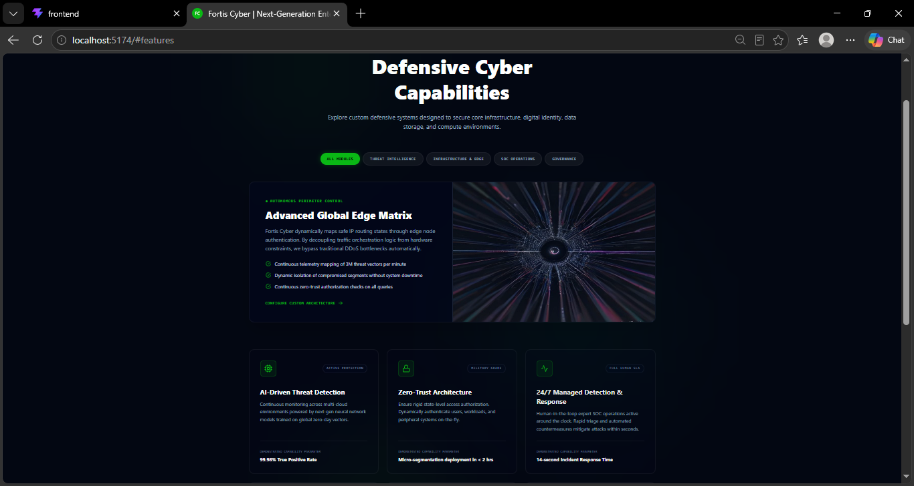
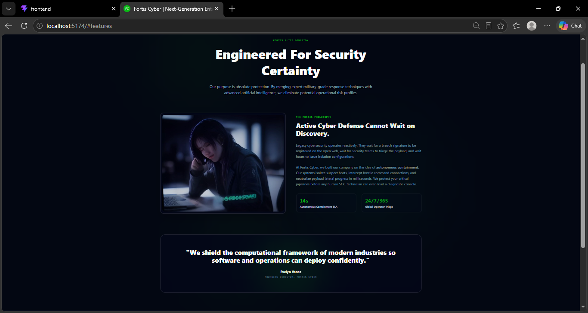
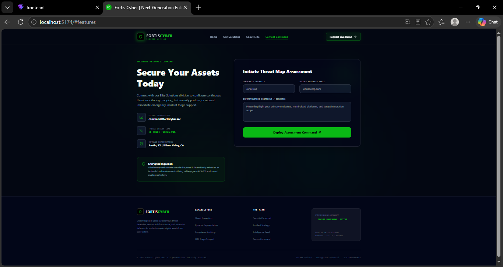

# AI Website Builder Agent

A powerful, AI-driven website builder that autonomously orchestrates, designs, and executes code to generate complete, beautiful React and Tailwind CSS full-stack websites based on a simple user prompt.

## Project Screenshots

<table align="center">
  <tr>
    <td align="center">
      <b>Generated Application - View 1</b><br/>
      
    </td>
    <td align="center">
      <b>Generated Application - View 2</b><br/>
      
    </td>
  </tr>
  <tr>
    <td align="center">
      <b>Generated Application - View 3</b><br/>
      
    </td>
    <td align="center">
      <b>Generated Application - View 4</b><br/>
      
    </td>
  </tr>
</table>

---

## Architecture and Agentic Flow

This project utilizes a Multi-Agent Architecture powered by Google's Gemini API to automate the software development lifecycle. When a user provides their business details, specialized agents handle the process autonomously.

### 1. Orchestrator Agent (The Manager)
- **Role:** Understands the business requirements, tone, and brand color.
- **Action:** Plans the website structure, determining the necessary sections and layout.
- **Model:** gemini-3.5-flash

### 2. Asset Agent (The Designer)
- **Role:** Analyzes the business description to extract core semantic keywords.
- **Action:** Dynamically fetches hyper-realistic stock images and generates a professional brand logo utilizing external APIs based on the extracted keywords.
- **Model:** gemini-3.5-flash

### 3. Design Agent (The Engineer)
- **Role:** Writes the actual frontend and backend application code.
- **Action:** Receives the Orchestrator's plan and Asset Agent's resources, then writes a complete, multi-page React application integrated with a Node.js Express backend.

### 4. Execution Agent (The Delivery Boy)
- **Role:** Handles system-level operations.
- **Action:** Takes the code generated by the Design Agent and automatically scaffolds a completely new full-stack Vite + React + Express project on the local disk.

---

## Technology Stack
- **Frontend (UI):** React, Tailwind CSS, Vite
- **Backend (API):** Node.js, Express, TypeScript
- **AI Models:** Google Gemini 3.5 Flash
- **Orchestration:** Custom JSON-based prompt chaining and multi-agent communication.

## How to Run the AI Builder

1. Clone the repository.
2. Add your Gemini API key in `backend/.env` as `GEMINI_API_KEY`.
3. Install dependencies and start the backend:
   ```bash
   cd backend
   npm install
   npm run dev
   ```
4. Install dependencies and start the frontend:
   ```bash
   cd frontend
   npm install
   npm run dev
   ```

## How to Run the Generated Website

Once the AI Builder has successfully generated your website, you can run the full-stack application by navigating to the newly created workspace.

1. Start the Generated Backend:
   ```bash
   cd generated_workspace/backend
   npm install
   npm start
   ```
2. Start the Generated Frontend:
   ```bash
   cd generated_workspace/frontend
   npm install
   npm run dev
   ```

---
*Built using Google Gemini AI.*
