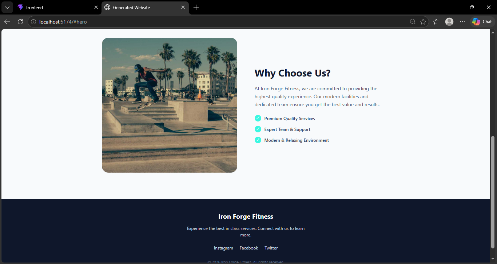
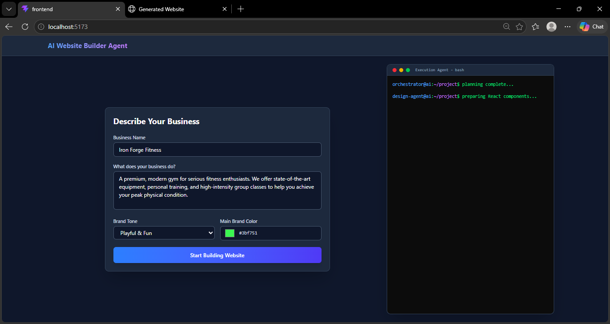
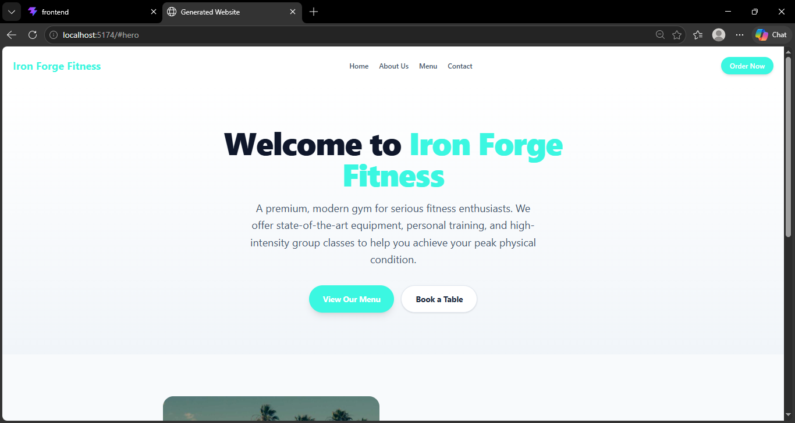

# AI Website Builder Agent 🤖✨

A powerful, AI-driven website builder that autonomously orchestrates, designs, and executes code to generate complete, beautiful React & Tailwind CSS websites based on a simple user prompt.

## 📸 Project Screenshots

### AI Builder Interface (Frontend)

### Website Generation Process

### Generated AI Website (Iron Forge Fitness)

---

## 🚀 How It Works (The Agentic Flow)

This project uses a **Multi-Agent Architecture** powered by Google's Gemini API to automate the software development lifecycle. When a user provides their business details, 4 specialized agents take over:

### 1. Orchestrator Agent (The Manager)
- **Role:** Understands the business requirements, tone, and brand color.
- **Action:** Plans the website structure (e.g., deciding which sections are needed: Hero, About, Menu, Contact).
- **Model:** \`gemini-3.5-flash\`

### 2. Asset Agent (The Designer)
- **Role:** Analyzes the business description to extract core semantic keywords.
- **Action:** Dynamically generates reliable HD placeholder image URLs (via Picsum/LoremFlickr) that match the aesthetic of the business.
- **Model:** \`gemini-3.5-flash\`

### 3. Design Agent (The Engineer)
- **Role:** Writes the actual frontend code.
- **Action:** Receives the Orchestrator's plan and Asset Agent's images, then writes a complete, single-file **React + Tailwind CSS** component representing a premium landing page.
- **Model:** \`gemini-3.5-flash\`
- **Fallback Mechanism:** Implemented a smart fallback system to generate a fully dynamic and beautiful generic template if the API quota is exceeded, ensuring the workflow never breaks.

### 4. Execution Agent (The Delivery Boy)
- **Role:** Handles system-level operations.
- **Action:** Takes the code generated by the Design Agent and automatically scaffolds a completely new **Vite + React** project on the user's local disk, saving all files in the \`generated_workspace/\` directory.

---

## 🛠️ Technology Stack
- **Frontend (UI):** React, Tailwind CSS, Vite
- **Backend (API):** Node.js, Express, TypeScript
- **AI Models:** Google Gemini 3.5 Flash
- **Orchestration:** Custom JSON-based prompt chaining and multi-agent communication.

## 🏃‍♂️ How to Run

1. Clone the repository.
2. Add your Gemini API key in \`backend/.env\` as \`GEMINI_API_KEY\`.
3. Install dependencies and start the backend:
   \`\`\`bash
   cd backend
   npm install
   npm run dev
   \`\`\`
4. Install dependencies and start the frontend:
   \`\`\`bash
   cd frontend
   npm install
   npm run dev
   \`\`\`
5. Once your website is generated, it is automatically saved to \`generated_workspace/frontend\`. You can navigate there, install dependencies, and run your new website!

---
*Built with ❤️ using Google Gemini AI.*
